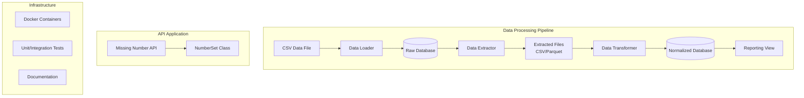

# Design Document

## Overview

This technical test solution implements a comprehensive data processing pipeline and API development project. The system consists of two main components:

1. **Data Processing Pipeline**: A complete ETL (Extract, Transform, Load) system that processes transaction data from CSV files, transforms it according to business requirements, and stores it in a normalized database structure.

2. **Missing Number API**: A REST API application that solves the algorithmic problem of finding a missing number from the first 100 natural numbers.

The solution demonstrates proficiency in data engineering, database design, API development, and software engineering best practices.

## Architecture

### System Architecture Overview



### Technology Stack

- **Programming Language**: Python 3.9+
- **Database**: PostgreSQL (primary choice) with MySQL alternative
- **Data Processing**: pandas, SQLAlchemy
- **API Framework**: FastAPI
- **Containerization**: Docker & Docker Compose
- **Testing**: pytest
- **Data Formats**: CSV, Parquet

## Components and Interfaces

### 1. Data Processing Pipeline Components

#### 1.1 Data Loader Module
```python
class DataLoader:
    def __init__(self, db_connection: str)
    def load_csv_to_database(self, csv_path: str) -> bool
    def validate_data_integrity(self) -> ValidationReport
```

**Responsibilities:**
- Load CSV data into raw database tables
- Perform initial data validation
- Handle data type conversions and null values
- Generate loading reports and statistics

#### 1.2 Data Extractor Module
```python
class DataExtractor:
    def __init__(self, db_connection: str)
    def extract_to_csv(self, output_path: str) -> str
    def extract_to_parquet(self, output_path: str) -> str
    def get_extraction_metadata(self) -> dict
```

**Responsibilities:**
- Extract data from database to various formats
- Optimize extraction queries for performance
- Handle large datasets with chunking
- Provide extraction metadata and statistics

#### 1.3 Data Transformer Module
```python
class DataTransformer:
    def __init__(self, input_source: str)
    def transform_to_schema(self) -> pd.DataFrame
    def validate_transformed_data(self) -> ValidationReport
    def apply_business_rules(self) -> pd.DataFrame
```

**Responsibilities:**
- Transform data to match target schema
- Handle data type conversions and formatting
- Apply business rules and data cleaning
- Validate transformed data quality

#### 1.4 Database Manager Module
```python
class DatabaseManager:
    def __init__(self, connection_string: str)
    def create_normalized_schema(self) -> bool
    def load_transformed_data(self, data: pd.DataFrame) -> bool
    def create_reporting_view(self) -> bool
```

**Responsibilities:**
- Manage database connections and transactions
- Create and maintain database schema
- Handle data loading into normalized tables
- Create and manage database views

### 2. Missing Number API Components

#### 2.1 NumberSet Class
```python
class NumberSet:
    def __init__(self, max_number: int = 100)
    def extract(self, number: int) -> bool
    def find_missing_number(self) -> int
    def get_current_set(self) -> List[int]
    def reset(self) -> None
```

**Responsibilities:**
- Maintain set of natural numbers 1-100
- Provide extraction functionality
- Calculate missing numbers using mathematical approach
- Validate input parameters

#### 2.2 API Endpoints
```python
@app.post("/extract/{number}")
async def extract_number(number: int) -> ExtractResponse

@app.get("/missing")
async def get_missing_number() -> MissingNumberResponse

@app.post("/reset")
async def reset_set() -> ResetResponse
```

**Responsibilities:**
- Provide REST API interface
- Handle input validation
- Return structured responses
- Manage API state

## Data Models

### Database Schema Design

#### Raw Data Table (Initial Load)
```sql
CREATE TABLE raw_transactions (
    id VARCHAR(64) PRIMARY KEY,
    name VARCHAR(130),
    company_id VARCHAR(64),
    amount DECIMAL(16,2),
    status VARCHAR(50),
    created_at VARCHAR(50),
    paid_at VARCHAR(50)
);
```

#### Normalized Schema

**Companies Table:**
```sql
CREATE TABLE companies (
    company_id VARCHAR(24) PRIMARY KEY,
    company_name VARCHAR(130) NOT NULL,
    created_at TIMESTAMP DEFAULT CURRENT_TIMESTAMP,
    updated_at TIMESTAMP DEFAULT CURRENT_TIMESTAMP ON UPDATE CURRENT_TIMESTAMP
);
```

**Charges Table:**
```sql
CREATE TABLE charges (
    id VARCHAR(24) PRIMARY KEY,
    company_id VARCHAR(24) NOT NULL,
    amount DECIMAL(16,2) NOT NULL,
    status VARCHAR(30) NOT NULL,
    created_at TIMESTAMP NOT NULL,
    updated_at TIMESTAMP NULL,
    FOREIGN KEY (company_id) REFERENCES companies(company_id)
);
```

#### Reporting View
```sql
CREATE VIEW daily_transaction_summary AS
SELECT 
    DATE(c.created_at) as transaction_date,
    comp.company_name,
    comp.company_id,
    SUM(c.amount) as total_amount,
    COUNT(*) as transaction_count
FROM charges c
JOIN companies comp ON c.company_id = comp.company_id
WHERE c.status IN ('paid', 'refunded')
GROUP BY DATE(c.created_at), comp.company_id, comp.company_name
ORDER BY transaction_date DESC, total_amount DESC;
```

### API Data Models

```python
class ExtractRequest(BaseModel):
    number: int = Field(..., ge=1, le=100)

class ExtractResponse(BaseModel):
    success: bool
    message: str
    extracted_number: int
    remaining_count: int

class MissingNumberResponse(BaseModel):
    missing_number: int
    calculation_method: str
    execution_time_ms: float
```

## Error Handling

### Data Processing Error Handling

1. **Data Loading Errors:**
   - Invalid CSV format handling
   - Database connection failures
   - Data type conversion errors
   - Duplicate key violations

2. **Transformation Errors:**
   - Schema validation failures
   - Data quality issues
   - Business rule violations
   - Missing required fields

3. **Database Errors:**
   - Connection timeouts
   - Transaction rollback scenarios
   - Constraint violations
   - Performance issues

### API Error Handling

1. **Input Validation:**
   - Number range validation (1-100)
   - Data type validation
   - Request format validation

2. **Business Logic Errors:**
   - Attempting to extract already extracted number
   - Invalid state operations
   - Calculation errors

3. **System Errors:**
   - Internal server errors
   - Resource unavailability
   - Timeout handling

## Testing Strategy

### Data Processing Tests

1. **Unit Tests:**
   - Individual component functionality
   - Data transformation logic
   - Database operations
   - Error handling scenarios

2. **Integration Tests:**
   - End-to-end pipeline execution
   - Database integration
   - File I/O operations
   - Cross-component interactions

3. **Data Quality Tests:**
   - Schema validation
   - Data integrity checks
   - Business rule compliance
   - Performance benchmarks

### API Tests

1. **Unit Tests:**
   - NumberSet class functionality
   - Mathematical calculations
   - Input validation
   - State management

2. **API Tests:**
   - Endpoint functionality
   - Request/response validation
   - Error handling
   - Performance testing

3. **Integration Tests:**
   - Full API workflow
   - State persistence
   - Concurrent request handling

### Test Data Strategy

- **Synthetic Data Generation:** Create test datasets with known characteristics
- **Edge Case Testing:** Test boundary conditions and error scenarios
- **Performance Testing:** Validate system performance with large datasets
- **Regression Testing:** Ensure changes don't break existing functionality

## Database Choice Rationale

### PostgreSQL (Primary Choice)

**Advantages:**
- Excellent support for complex data types and JSON
- Strong ACID compliance and transaction handling
- Advanced indexing capabilities for performance
- Robust ecosystem and community support
- Better handling of concurrent connections
- Superior performance for analytical queries

**Use Case Fit:**
- Handles the transaction data volume efficiently
- Supports complex aggregation queries for reporting
- Provides excellent data integrity guarantees
- Scales well for future growth

### MySQL (Alternative Choice)

**Advantages:**
- Widespread adoption and familiarity
- Good performance for read-heavy workloads
- Simpler setup and maintenance
- Strong community support

**Trade-offs:**
- Less advanced analytical capabilities
- More limited JSON support
- Potential issues with complex transactions

## Performance Considerations

### Data Processing Optimization

1. **Batch Processing:** Process data in configurable batch sizes
2. **Indexing Strategy:** Create appropriate indexes for query performance
3. **Connection Pooling:** Manage database connections efficiently
4. **Memory Management:** Handle large datasets without memory issues

### API Performance

1. **Algorithm Efficiency:** Use mathematical approach (sum formula) for O(1) missing number calculation
2. **Caching:** Implement appropriate caching strategies
3. **Async Processing:** Use FastAPI's async capabilities
4. **Resource Management:** Efficient memory and CPU usage

## Security Considerations

1. **Database Security:**
   - Use parameterized queries to prevent SQL injection
   - Implement proper authentication and authorization
   - Encrypt sensitive data at rest and in transit

2. **API Security:**
   - Input validation and sanitization
   - Rate limiting to prevent abuse
   - Proper error message handling (no sensitive data exposure)

3. **Infrastructure Security:**
   - Secure Docker configurations
   - Environment variable management
   - Network security considerations

## Deployment Architecture

### Docker Containerization

```yaml
services:
  database:
    image: postgres:13
    environment:
      - POSTGRES_DB=technical_test
      - POSTGRES_USER=testuser
      - POSTGRES_PASSWORD=testpass
    
  data-processor:
    build: ./data-processor
    depends_on:
      - database
    volumes:
      - ./data:/app/data
    
  api:
    build: ./api
    ports:
      - "8000:8000"
    depends_on:
      - database
```

### Scalability Considerations

1. **Horizontal Scaling:** Design components to support multiple instances
2. **Database Scaling:** Consider read replicas for reporting queries
3. **Caching Layer:** Implement Redis for frequently accessed data
4. **Load Balancing:** Support multiple API instances behind load balancer