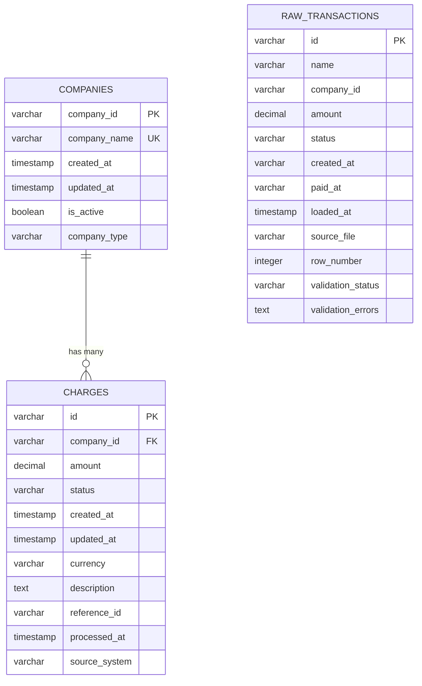

# Database Schema Documentation

## Overview

This document provides comprehensive documentation for the database schema used in the Prueba Técnica Python project. The database implements a two-schema approach with raw data staging and normalized business tables, designed for efficient data processing and reporting.

## Table of Contents

- [Architecture Overview](#architecture-overview)
- [Schema Design Principles](#schema-design-principles)
- [Raw Data Schema](#raw-data-schema)
- [Normalized Schema](#normalized-schema)
- [Relationships and Constraints](#relationships-and-constraints)
- [Indexes and Performance](#indexes-and-performance)
- [Views and Reporting](#views-and-reporting)
- [Data Types and Constraints](#data-types-and-constraints)
- [Migration Scripts](#migration-scripts)
- [Performance Considerations](#performance-considerations)
- [Backup and Recovery](#backup-and-recovery)

## Architecture Overview

### Database System
- **RDBMS**: PostgreSQL 13+
- **Schemas**: Two-schema approach (raw_data, normalized_data)
- **Encoding**: UTF-8
- **Collation**: en_US.UTF-8

### Schema Structure
```
prueba_tecnica (database)
├── raw_data (schema)
│   └── raw_transactions (table)
└── normalized_data (schema)
    ├── companies (table)
    ├── charges (table)
    └── daily_transaction_summary (view)
```

### Design Philosophy
- **Separation of Concerns**: Raw data staging separate from business logic
- **Data Integrity**: Foreign key constraints and validation rules
- **Performance**: Optimized indexes for both OLTP and OLAP workloads
- **Scalability**: Designed for horizontal and vertical scaling
- **Maintainability**: Clear naming conventions and documentation

## Schema Design Principles

### 1. Two-Schema Approach

#### Raw Data Schema (`raw_data`)
- **Purpose**: Initial data ingestion and staging
- **Characteristics**: Minimal validation, preserves original data format
- **Usage**: ETL source, data quality analysis, audit trail

#### Normalized Schema (`normalized_data`)
- **Purpose**: Business-ready data with proper relationships
- **Characteristics**: Full validation, normalized structure, optimized for queries
- **Usage**: Application queries, reporting, analytics

### 2. Normalization Strategy
- **Third Normal Form (3NF)**: Eliminates data redundancy
- **Referential Integrity**: Foreign key constraints ensure data consistency
- **Atomic Values**: Each column contains indivisible values
- **Functional Dependencies**: Proper dependency management

### 3. Data Quality Approach
- **Validation at Multiple Levels**: Database constraints, application validation
- **Error Handling**: Graceful handling of data quality issues
- **Audit Trail**: Tracking of data lineage and transformations
- **Data Profiling**: Regular analysis of data quality metrics

## Raw Data Schema

### Purpose and Usage

The `raw_data` schema serves as the initial landing zone for CSV data ingestion. It preserves the original data format while providing basic structure for processing.

### Tables

#### `raw_transactions`

**Purpose**: Initial staging table for CSV transaction data

```sql
CREATE SCHEMA IF NOT EXISTS raw_data;

CREATE TABLE raw_data.raw_transactions (
    -- Primary identifier
    id VARCHAR(64) PRIMARY KEY,
    
    -- Company information
    name VARCHAR(130),
    company_id VARCHAR(64),
    
    -- Transaction details
    amount DECIMAL(16,2),
    status VARCHAR(50),
    
    -- Temporal data (as strings from CSV)
    created_at VARCHAR(50),
    paid_at VARCHAR(50),
    
    -- Audit fields
    loaded_at TIMESTAMP DEFAULT CURRENT_TIMESTAMP,
    source_file VARCHAR(255),
    row_number INTEGER,
    
    -- Data quality fields
    validation_status VARCHAR(20) DEFAULT 'pending',
    validation_errors TEXT,
    
    -- Indexes
    INDEX idx_raw_transactions_company_id (company_id),
    INDEX idx_raw_transactions_status (status),
    INDEX idx_raw_transactions_loaded_at (loaded_at),
    INDEX idx_raw_transactions_validation (validation_status)
);
```

**Field Descriptions:**

| Field | Type | Description | Constraints |
|-------|------|-------------|-------------|
| `id` | VARCHAR(64) | Unique transaction identifier | PRIMARY KEY, NOT NULL |
| `name` | VARCHAR(130) | Company name from CSV | NULL allowed |
| `company_id` | VARCHAR(64) | Company identifier | NULL allowed |
| `amount` | DECIMAL(16,2) | Transaction amount | NULL allowed |
| `status` | VARCHAR(50) | Transaction status | NULL allowed |
| `created_at` | VARCHAR(50) | Creation timestamp (string) | NULL allowed |
| `paid_at` | VARCHAR(50) | Payment timestamp (string) | NULL allowed |
| `loaded_at` | TIMESTAMP | Data loading timestamp | DEFAULT CURRENT_TIMESTAMP |
| `source_file` | VARCHAR(255) | Source CSV filename | NULL allowed |
| `row_number` | INTEGER | Row number in source file | NULL allowed |
| `validation_status` | VARCHAR(20) | Validation result | DEFAULT 'pending' |
| `validation_errors` | TEXT | Validation error details | NULL allowed |

**Usage Examples:**

```sql
-- Load data from CSV (handled by application)
INSERT INTO raw_data.raw_transactions (id, name, company_id, amount, status, created_at, paid_at, source_file, row_number)
VALUES ('tx_001', 'Company A', 'comp_001', 1500.00, 'paid', '2024-01-15 10:30:00', '2024-01-15 10:35:00', 'data_prueba_técnica.csv', 1);

-- Query raw data for validation
SELECT 
    validation_status,
    COUNT(*) as record_count,
    COUNT(CASE WHEN validation_errors IS NOT NULL THEN 1 END) as error_count
FROM raw_data.raw_transactions
GROUP BY validation_status;

-- Find data quality issues
SELECT id, validation_errors
FROM raw_data.raw_transactions
WHERE validation_status = 'failed'
LIMIT 10;
```

## Normalized Schema

### Purpose and Usage

The `normalized_data` schema contains business-ready data with proper relationships, validation, and optimization for application queries and reporting.

### Tables

#### `companies`

**Purpose**: Master table for company information

```sql
CREATE SCHEMA IF NOT EXISTS normalized_data;

CREATE TABLE normalized_data.companies (
    -- Primary key
    company_id VARCHAR(24) PRIMARY KEY,
    
    -- Company details
    company_name VARCHAR(130) NOT NULL,
    
    -- Audit timestamps
    created_at TIMESTAMP DEFAULT CURRENT_TIMESTAMP,
    updated_at TIMESTAMP DEFAULT CURRENT_TIMESTAMP,
    
    -- Business fields
    is_active BOOLEAN DEFAULT true,
    company_type VARCHAR(50),
    
    -- Constraints
    CONSTRAINT chk_company_name_length CHECK (LENGTH(company_name) >= 1),
    CONSTRAINT chk_company_id_format CHECK (company_id ~ '^[a-zA-Z0-9_-]+$'),
    
    -- Indexes
    INDEX idx_companies_name (company_name),
    INDEX idx_companies_created (created_at),
    INDEX idx_companies_active (is_active),
    UNIQUE INDEX idx_companies_name_unique (company_name)
);
```

**Field Descriptions:**

| Field | Type | Description | Constraints |
|-------|------|-------------|-------------|
| `company_id` | VARCHAR(24) | Unique company identifier | PRIMARY KEY, NOT NULL |
| `company_name` | VARCHAR(130) | Company name | NOT NULL, UNIQUE |
| `created_at` | TIMESTAMP | Record creation time | DEFAULT CURRENT_TIMESTAMP |
| `updated_at` | TIMESTAMP | Last update time | DEFAULT CURRENT_TIMESTAMP |
| `is_active` | BOOLEAN | Company active status | DEFAULT true |
| `company_type` | VARCHAR(50) | Company type/category | NULL allowed |

#### `charges`

**Purpose**: Transaction charges with proper relationships and validation

```sql
CREATE TABLE normalized_data.charges (
    -- Primary key
    id VARCHAR(24) PRIMARY KEY,
    
    -- Foreign key to companies
    company_id VARCHAR(24) NOT NULL,
    
    -- Transaction details
    amount DECIMAL(16,2) NOT NULL,
    status VARCHAR(30) NOT NULL,
    
    -- Temporal data
    created_at TIMESTAMP NOT NULL,
    updated_at TIMESTAMP NULL,
    
    -- Additional business fields
    currency VARCHAR(3) DEFAULT 'USD',
    description TEXT,
    reference_id VARCHAR(64),
    
    -- Audit fields
    processed_at TIMESTAMP DEFAULT CURRENT_TIMESTAMP,
    source_system VARCHAR(50) DEFAULT 'csv_import',
    
    -- Constraints
    CONSTRAINT fk_charges_company 
        FOREIGN KEY (company_id) REFERENCES companies(company_id)
        ON DELETE RESTRICT ON UPDATE CASCADE,
    
    CONSTRAINT chk_amount_positive 
        CHECK (amount > 0),
    
    CONSTRAINT chk_status_valid 
        CHECK (status IN ('paid', 'pending', 'failed', 'refunded', 'cancelled')),
    
    CONSTRAINT chk_currency_format 
        CHECK (currency ~ '^[A-Z]{3}$'),
    
    CONSTRAINT chk_created_before_updated 
        CHECK (updated_at IS NULL OR updated_at >= created_at),
    
    -- Indexes
    INDEX idx_charges_company (company_id),
    INDEX idx_charges_status (status),
    INDEX idx_charges_created (created_at),
    INDEX idx_charges_amount (amount),
    INDEX idx_charges_processed (processed_at),
    INDEX idx_charges_reference (reference_id),
    
    -- Composite indexes for common queries
    INDEX idx_charges_company_status (company_id, status),
    INDEX idx_charges_created_status (created_at, status),
    INDEX idx_charges_amount_desc (amount DESC)
);
```

**Field Descriptions:**

| Field | Type | Description | Constraints |
|-------|------|-------------|-------------|
| `id` | VARCHAR(24) | Unique charge identifier | PRIMARY KEY, NOT NULL |
| `company_id` | VARCHAR(24) | Reference to company | FOREIGN KEY, NOT NULL |
| `amount` | DECIMAL(16,2) | Charge amount | NOT NULL, > 0 |
| `status` | VARCHAR(30) | Charge status | NOT NULL, CHECK constraint |
| `created_at` | TIMESTAMP | Charge creation time | NOT NULL |
| `updated_at` | TIMESTAMP | Last update time | NULL allowed |
| `currency` | VARCHAR(3) | Currency code | DEFAULT 'USD' |
| `description` | TEXT | Charge description | NULL allowed |
| `reference_id` | VARCHAR(64) | External reference | NULL allowed |
| `processed_at` | TIMESTAMP | Processing timestamp | DEFAULT CURRENT_TIMESTAMP |
| `source_system` | VARCHAR(50) | Source system identifier | DEFAULT 'csv_import' |

## Relationships and Constraints

### Entity Relationship Diagram



### Foreign Key Relationships

#### `charges.company_id` → `companies.company_id`
- **Type**: Many-to-One
- **Constraint**: `fk_charges_company`
- **On Delete**: RESTRICT (prevents deletion of companies with charges)
- **On Update**: CASCADE (updates propagate to charges)

### Check Constraints

#### Amount Validation
```sql
CONSTRAINT chk_amount_positive CHECK (amount > 0)
```
Ensures all charge amounts are positive values.

#### Status Validation
```sql
CONSTRAINT chk_status_valid CHECK (status IN ('paid', 'pending', 'failed', 'refunded', 'cancelled'))
```
Restricts status values to valid business states.

#### Temporal Consistency
```sql
CONSTRAINT chk_created_before_updated CHECK (updated_at IS NULL OR updated_at >= created_at)
```
Ensures update timestamps are after creation timestamps.

#### Data Format Validation
```sql
CONSTRAINT chk_currency_format CHECK (currency ~ '^[A-Z]{3}$')
CONSTRAINT chk_company_id_format CHECK (company_id ~ '^[a-zA-Z0-9_-]+$')
```
Validates data format using regular expressions.

## Indexes and Performance

### Index Strategy

#### Primary Indexes
- **Primary Keys**: Automatic unique indexes on all primary keys
- **Foreign Keys**: Indexes on all foreign key columns for join performance
- **Unique Constraints**: Unique indexes on business keys

#### Query Optimization Indexes

##### Single Column Indexes
```sql
-- Frequently filtered columns
CREATE INDEX idx_charges_status ON normalized_data.charges(status);
CREATE INDEX idx_charges_created ON normalized_data.charges(created_at);
CREATE INDEX idx_charges_amount ON normalized_data.charges(amount);

-- Company lookups
CREATE INDEX idx_companies_name ON normalized_data.companies(company_name);
CREATE INDEX idx_companies_active ON normalized_data.companies(is_active);
```

##### Composite Indexes
```sql
-- Common query patterns
CREATE INDEX idx_charges_company_status ON normalized_data.charges(company_id, status);
CREATE INDEX idx_charges_created_status ON normalized_data.charges(created_at, status);

-- Reporting queries
CREATE INDEX idx_charges_date_company ON normalized_data.charges(DATE(created_at), company_id);
```

##### Specialized Indexes
```sql
-- Descending order for top amounts
CREATE INDEX idx_charges_amount_desc ON normalized_data.charges(amount DESC);

-- Partial indexes for active records
CREATE INDEX idx_companies_active_name ON normalized_data.companies(company_name) 
WHERE is_active = true;
```

### Performance Monitoring

#### Index Usage Analysis
```sql
-- Check index usage statistics
SELECT 
    schemaname,
    tablename,
    indexname,
    idx_scan,
    idx_tup_read,
    idx_tup_fetch
FROM pg_stat_user_indexes
WHERE schemaname IN ('raw_data', 'normalized_data')
ORDER BY idx_scan DESC;
```

#### Query Performance
```sql
-- Analyze query performance
EXPLAIN (ANALYZE, BUFFERS) 
SELECT c.company_name, SUM(ch.amount)
FROM normalized_data.companies c
JOIN normalized_data.charges ch ON c.company_id = ch.company_id
WHERE ch.status = 'paid'
  AND ch.created_at >= '2024-01-01'
GROUP BY c.company_name;
```

## Views and Reporting

### Business Views

#### `daily_transaction_summary`

**Purpose**: Aggregated daily transaction data for business reporting

```sql
CREATE VIEW normalized_data.daily_transaction_summary AS
SELECT 
    -- Date dimension
    DATE(c.created_at) as transaction_date,
    EXTRACT(YEAR FROM c.created_at) as year,
    EXTRACT(MONTH FROM c.created_at) as month,
    EXTRACT(DOW FROM c.created_at) as day_of_week,
    
    -- Company dimension
    comp.company_name,
    comp.company_id,
    comp.company_type,
    
    -- Metrics
    SUM(c.amount) as total_amount,
    COUNT(*) as transaction_count,
    AVG(c.amount) as average_amount,
    MIN(c.amount) as min_amount,
    MAX(c.amount) as max_amount,
    STDDEV(c.amount) as amount_stddev,
    
    -- Status breakdown
    COUNT(CASE WHEN c.status = 'paid' THEN 1 END) as paid_count,
    COUNT(CASE WHEN c.status = 'pending' THEN 1 END) as pending_count,
    COUNT(CASE WHEN c.status = 'failed' THEN 1 END) as failed_count,
    COUNT(CASE WHEN c.status = 'refunded' THEN 1 END) as refunded_count,
    COUNT(CASE WHEN c.status = 'cancelled' THEN 1 END) as cancelled_count,
    
    -- Amount by status
    SUM(CASE WHEN c.status = 'paid' THEN c.amount ELSE 0 END) as paid_amount,
    SUM(CASE WHEN c.status = 'refunded' THEN c.amount ELSE 0 END) as refunded_amount,
    
    -- Calculated fields
    ROUND(
        (COUNT(CASE WHEN c.status = 'paid' THEN 1 END)::DECIMAL / COUNT(*)) * 100, 
        2
    ) as success_rate_percent,
    
    -- Temporal fields
    MIN(c.created_at) as first_transaction_time,
    MAX(c.created_at) as last_transaction_time

FROM normalized_data.charges c
JOIN normalized_data.companies comp ON c.company_id = comp.company_id
WHERE c.status IN ('paid', 'pending', 'failed', 'refunded', 'cancelled')
GROUP BY 
    DATE(c.created_at),
    EXTRACT(YEAR FROM c.created_at),
    EXTRACT(MONTH FROM c.created_at),
    EXTRACT(DOW FROM c.created_at),
    comp.company_id, 
    comp.company_name,
    comp.company_type
ORDER BY 
    transaction_date DESC, 
    total_amount DESC;
```

#### Usage Examples

```sql
-- Daily summary for specific company
SELECT * FROM normalized_data.daily_transaction_summary
WHERE company_name = 'Company A'
  AND transaction_date >= '2024-01-01'
ORDER BY transaction_date DESC;

-- Top performing days
SELECT 
    transaction_date,
    SUM(total_amount) as daily_total,
    SUM(transaction_count) as daily_transactions
FROM normalized_data.daily_transaction_summary
GROUP BY transaction_date
ORDER BY daily_total DESC
LIMIT 10;

-- Monthly trends
SELECT 
    year,
    month,
    SUM(total_amount) as monthly_total,
    AVG(success_rate_percent) as avg_success_rate
FROM normalized_data.daily_transaction_summary
GROUP BY year, month
ORDER BY year DESC, month DESC;
```

### Materialized Views (Future Enhancement)

For better performance with large datasets, consider materialized views:

```sql
-- Example materialized view for monthly summaries
CREATE MATERIALIZED VIEW normalized_data.monthly_summary AS
SELECT 
    EXTRACT(YEAR FROM transaction_date) as year,
    EXTRACT(MONTH FROM transaction_date) as month,
    company_id,
    company_name,
    SUM(total_amount) as monthly_total,
    SUM(transaction_count) as monthly_transactions,
    AVG(average_amount) as avg_transaction_amount
FROM normalized_data.daily_transaction_summary
GROUP BY 
    EXTRACT(YEAR FROM transaction_date),
    EXTRACT(MONTH FROM transaction_date),
    company_id,
    company_name;

-- Refresh materialized view
REFRESH MATERIALIZED VIEW normalized_data.monthly_summary;
```

## Data Types and Constraints

### Data Type Decisions

#### Monetary Values
- **Type**: `DECIMAL(16,2)`
- **Rationale**: Exact precision for financial calculations, avoids floating-point errors
- **Range**: Up to 99,999,999,999,999.99
- **Alternative**: `NUMERIC` for unlimited precision

#### Identifiers
- **Type**: `VARCHAR(24)` for business IDs, `VARCHAR(64)` for system IDs
- **Rationale**: Fixed-length strings for consistent performance
- **Format**: Alphanumeric with underscores and hyphens allowed

#### Timestamps
- **Type**: `TIMESTAMP` (without timezone for simplicity)
- **Rationale**: Consistent temporal data handling
- **Alternative**: `TIMESTAMPTZ` for timezone-aware applications

#### Status Fields
- **Type**: `VARCHAR(30)` with CHECK constraints
- **Rationale**: Readable status values with validation
- **Alternative**: `ENUM` types for stricter validation

### Constraint Philosophy

#### Data Integrity
- **Primary Keys**: Ensure entity uniqueness
- **Foreign Keys**: Maintain referential integrity
- **Check Constraints**: Validate business rules
- **Not Null**: Prevent missing critical data

#### Performance Considerations
- **Index Strategy**: Balance query performance with write overhead
- **Constraint Validation**: Minimize validation overhead while ensuring data quality
- **Data Types**: Choose appropriate types for storage efficiency

## Migration Scripts

### Schema Creation Script

```sql
-- Create database and schemas
CREATE DATABASE prueba_tecnica;
\c prueba_tecnica;

-- Create schemas
CREATE SCHEMA IF NOT EXISTS raw_data;
CREATE SCHEMA IF NOT EXISTS normalized_data;

-- Set search path
SET search_path TO normalized_data, raw_data, public;

-- Create tables (see individual table definitions above)
-- ... (table creation scripts)

-- Create views
-- ... (view creation scripts)

-- Create indexes
-- ... (index creation scripts)

-- Grant permissions
GRANT USAGE ON SCHEMA raw_data TO application_user;
GRANT USAGE ON SCHEMA normalized_data TO application_user;
GRANT SELECT, INSERT, UPDATE, DELETE ON ALL TABLES IN SCHEMA raw_data TO application_user;
GRANT SELECT, INSERT, UPDATE, DELETE ON ALL TABLES IN SCHEMA normalized_data TO application_user;
GRANT SELECT ON ALL TABLES IN SCHEMA normalized_data TO reporting_user;
```

### Data Migration Script

```sql
-- Migrate data from raw to normalized schema
BEGIN;

-- Insert companies (deduplicated)
INSERT INTO normalized_data.companies (company_id, company_name, created_at)
SELECT DISTINCT 
    company_id,
    name as company_name,
    MIN(CAST(created_at AS TIMESTAMP)) as created_at
FROM raw_data.raw_transactions
WHERE company_id IS NOT NULL 
  AND name IS NOT NULL
  AND validation_status = 'valid'
GROUP BY company_id, name
ON CONFLICT (company_id) DO NOTHING;

-- Insert charges
INSERT INTO normalized_data.charges (
    id, company_id, amount, status, created_at, updated_at
)
SELECT 
    rt.id,
    rt.company_id,
    rt.amount,
    LOWER(rt.status) as status,
    CAST(rt.created_at AS TIMESTAMP) as created_at,
    CASE 
        WHEN rt.paid_at IS NOT NULL AND rt.paid_at != '' 
        THEN CAST(rt.paid_at AS TIMESTAMP)
        ELSE NULL 
    END as updated_at
FROM raw_data.raw_transactions rt
WHERE rt.validation_status = 'valid'
  AND rt.company_id IS NOT NULL
  AND rt.amount IS NOT NULL
  AND rt.status IS NOT NULL
  AND EXISTS (
      SELECT 1 FROM normalized_data.companies c 
      WHERE c.company_id = rt.company_id
  );

COMMIT;
```

## Performance Considerations

### Query Optimization

#### Common Query Patterns
1. **Company-based filtering**: Use `company_id` indexes
2. **Date range queries**: Use `created_at` indexes
3. **Status filtering**: Use `status` indexes
4. **Amount-based sorting**: Use `amount DESC` indexes

#### Optimization Techniques
- **Composite Indexes**: For multi-column WHERE clauses
- **Partial Indexes**: For frequently filtered subsets
- **Covering Indexes**: Include SELECT columns in index
- **Query Rewriting**: Use views for complex queries

### Scaling Strategies

#### Vertical Scaling
- **Memory**: Increase shared_buffers and work_mem
- **CPU**: Optimize parallel query settings
- **Storage**: Use SSD storage for better I/O performance

#### Horizontal Scaling
- **Read Replicas**: For reporting and analytics
- **Partitioning**: By date or company for large tables
- **Sharding**: Distribute data across multiple databases

### Monitoring and Maintenance

#### Regular Maintenance Tasks
```sql
-- Update table statistics
ANALYZE normalized_data.companies;
ANALYZE normalized_data.charges;

-- Reindex if needed
REINDEX TABLE normalized_data.charges;

-- Check for unused indexes
SELECT * FROM pg_stat_user_indexes WHERE idx_scan = 0;
```

#### Performance Monitoring
```sql
-- Monitor slow queries
SELECT query, mean_time, calls, total_time
FROM pg_stat_statements
WHERE mean_time > 1000
ORDER BY mean_time DESC;

-- Check table sizes
SELECT 
    schemaname,
    tablename,
    pg_size_pretty(pg_total_relation_size(schemaname||'.'||tablename)) as size
FROM pg_tables
WHERE schemaname IN ('raw_data', 'normalized_data')
ORDER BY pg_total_relation_size(schemaname||'.'||tablename) DESC;
```

## Backup and Recovery

### Backup Strategy

#### Full Database Backup
```bash
# Create full backup
pg_dump -h localhost -U postgres -d prueba_tecnica > backup_full_$(date +%Y%m%d_%H%M%S).sql

# Compressed backup
pg_dump -h localhost -U postgres -d prueba_tecnica | gzip > backup_full_$(date +%Y%m%d_%H%M%S).sql.gz
```

#### Schema-specific Backup
```bash
# Backup specific schema
pg_dump -h localhost -U postgres -d prueba_tecnica -n normalized_data > backup_normalized_$(date +%Y%m%d_%H%M%S).sql

# Backup only data (no schema)
pg_dump -h localhost -U postgres -d prueba_tecnica --data-only > backup_data_$(date +%Y%m%d_%H%M%S).sql
```

### Recovery Procedures

#### Full Recovery
```bash
# Restore full database
psql -h localhost -U postgres -d prueba_tecnica < backup_full_20240115_120000.sql
```

#### Selective Recovery
```bash
# Restore specific schema
psql -h localhost -U postgres -d prueba_tecnica < backup_normalized_20240115_120000.sql

# Restore only data
psql -h localhost -U postgres -d prueba_tecnica < backup_data_20240115_120000.sql
```

### Disaster Recovery

#### Point-in-Time Recovery
- Configure WAL archiving for continuous backup
- Use pg_basebackup for base backups
- Implement automated backup verification

#### High Availability
- Set up streaming replication
- Configure automatic failover
- Implement connection pooling with failover support

This comprehensive database schema documentation provides all the necessary information for understanding, implementing, and maintaining the database structure for the Prueba Técnica Python project.